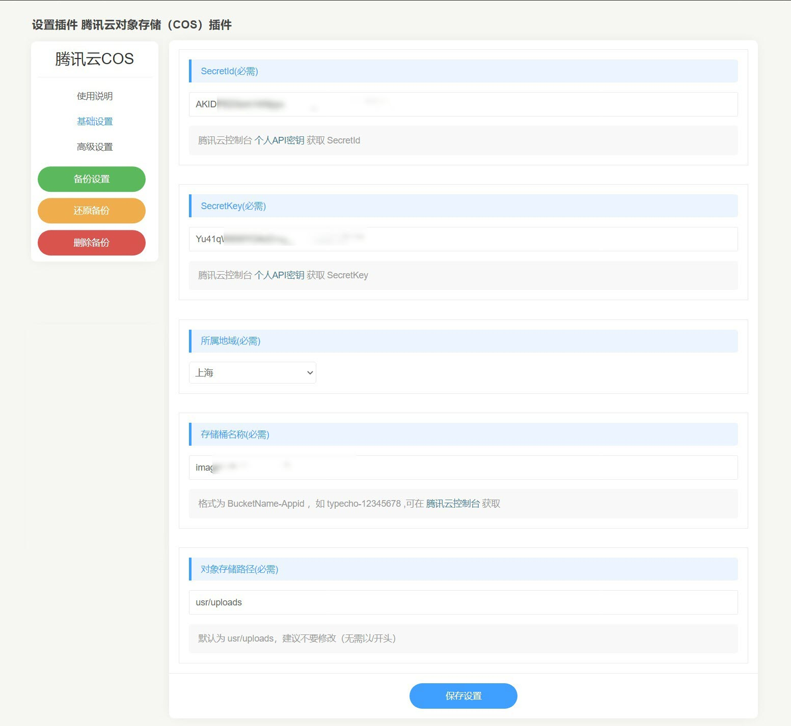
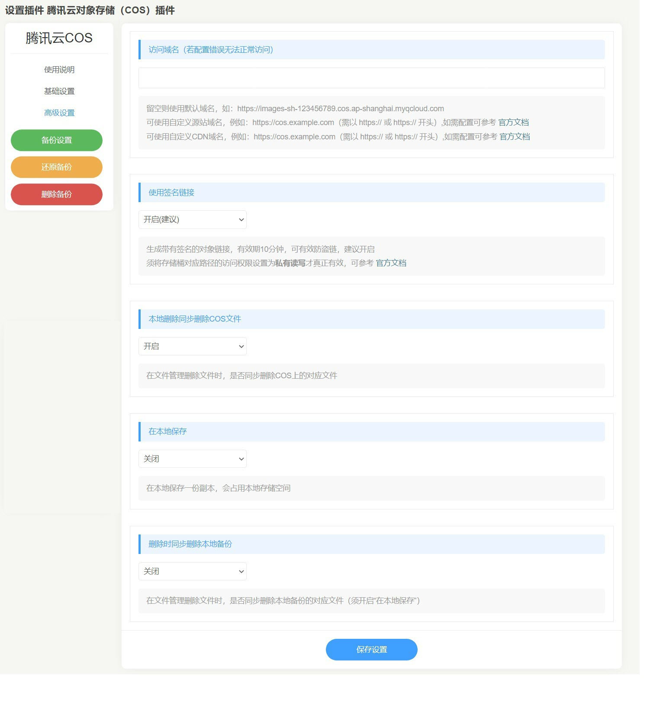

# 腾讯云对象存储插件（Typecho版）

## 0.版本依赖

- 依赖 PHP 5.6+ 环境

- 已测试Typecho版本：1.2.0

## 1.插件介绍
> Typecho COS插件是由苏苏开发的，提供给Typecho用户使用的插件。实现网站静态资源存储到腾讯云COS，有效降低本地存储负载，提升用户体验。

| 标题       | 名称                                                         |
| ---------- | ------------------------------------------------------------ |
| 中文名称   | 腾讯云对象存储（COS）插件                                  |
| 英文名称   | Typecho-Cos-Plugin                                 |
| 最新版本   | 1.0.1 (2022.08.09)                                     |
| 适用平台   | [Typecho](https://typecho.org/)                     |
| 适用产品   | [腾讯云对象存储（COS）](https://cloud.tencent.com/product/cos)       |
| GitHub项目 | [TypechoCosPlugin](https://github.com/cnhongv/typecho-cos-plugin) |

## 2.功能特性

- 支持验证桶名是否有效
- 可配置是否保留本地备份-默认不保留
- API动态获取域名列表
- 删除媒体文件时，支持删除/保留cos存储桶中对应文件

## 3.安装指引

### 3.1.部署方式：通过GitHub部署安装

> 1. git clone https://github.com/cnhongv/TypechoCosPlugin
> 2. 复制TypechoCosPlugin文件夹到Typecho安装路径/usr/plugins/内

## 4.使用指引

### 4.1.界面功能介绍

> 上图主要是配置COS插件的腾讯云基本参数，包括secretId、secretKey、所属地域、存储桶名称、对象存储路径

> 上图是额外配置，自定义访问域名、使用签名后的链接、本地删除同步删除COS文件、在本地保存、删除时同步删除本地备份

### 4.2.名词解释
> 以下部分内容来自[WordPress版腾讯云对象存储（COS）插件](https://github.com/Tencent-Cloud-Plugins/tencentcloud-wordpress-plugin-cos)
- **自定义密钥**：插件提供统一密钥管理，既可在多个腾讯云插件之间共享SecretId和SecretKey，也可为插件配置单独定义的腾讯云密钥。
- **SecretId**：在腾讯云云平台API密钥上申请的标识身份的 SecretId。详情参考[腾讯云文档](https://cloud.tencent.com/document/product)
- **SecretKey**：在腾讯云云平台API密钥上申请的标识身份的SecretId对应的SecretKey。详情参考[腾讯云文档](https://cloud.tencent.com/document/product)
- **所属地域**：在腾讯云服务器所在地域。详情参考[腾讯云文档](https://cloud.tencent.com/document/product/457/44232)
- **存储桶名称**：COS服务中存储桶的名称。详情参考[腾讯云文档](https://cloud.tencent.com/document/product/436/41153)
- **访问域名**：存储桶的域名。详情参考[腾讯云文档](https://cloud.tencent.com/document/product/436/6224)
- **在本地保存**：开启后，静态文件同步到腾讯云COS后在本地保存一份副本，会占用本地存储空间。
- **本地删除同步删除COS文件**：开启后，在文件管理删除文件时，会同步删除COS上的对应文件。
- **删除时同步删除本地备份**：开启后，在文件管理删除文件时，会同步删除本地备份的对应文件（须开启**在本地保存**）。

## 5.获取入口

| 插件入口          | 链接                                                         |
| ----------------- | ------------------------------------------------------------ |
| GitHub            | [link](https://github.com/cnhongv/typecho-cos-plugin)    |

## 6.FAQ

### 为什么激活插件后功能没有生效?
> 1. 腾讯云的COS服务是否正常开启，是否欠费；  
> 2. 首先确认配置参数SecretId、SecretKey、所属地域和存储桶名称是否都正确；
> 3. 到腾讯云的COS服务界面查看附件是否有上传；
> 4. 是否有开启防盗链功能；

## 7.版本迭代记录
### 2022.08.09 TypechoCosPlugin v1.0.1

### 2022.08.08 TypechoCosPlugin v1.0.0
- 支持验证桶名是否有效
- 可配置是否保留本地备份-默认不备份
- 支持上传文件自动重命名-默认支持

## 8.致谢

- 该插件使用了腾讯云CODS官方SDK [COS-PHP-SDK-V5](https://github.com/tencentyun/cos-php-sdk-v5)
- 该插件参考了 Typecho 插件 [CosForTypecho](https://github.com/jqjiang819/typecho-plugin-cosfile)、Typecho主题 [Joe](https://github.com/HaoOuBa/Joe) 及 WordPress 插件 [tencentcloud-cos](https://github.com/Tencent-Cloud-Plugins/tencentcloud-wordpress-plugin-cos) 的部分实现方法，特此对其主创团队进行致谢。

本项目由个人建设和维护，如有问题可以在Issues提交。